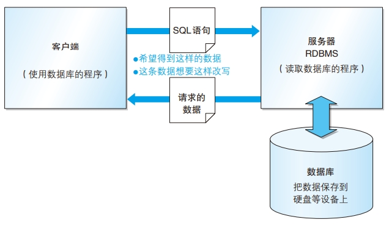
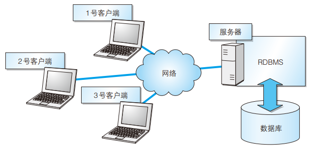
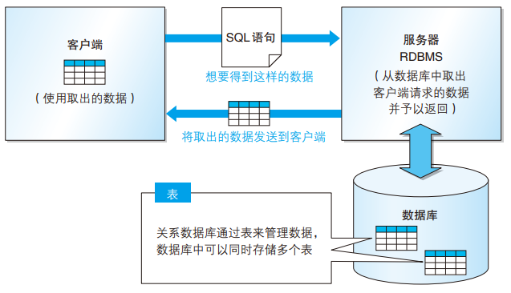

# 数据库和SQL

## 什么是数据库

通过计算机加工而成的可以进行高效访问的数据集合称为**数据库** (Database,DB)。

用来管理数据库的计算机系统称为**数据管理系统**(Database Management System,DBMS)

### 为什么用DBMS管理数据

- 无法多人共享数据
- 无法提供操作大量数据所需的格式
- 实现读写自动化需要编程能力
- 无法应对突发事故

### DBMS的种类

- 层次数据库(Hierarchical Database,HDB),最古老的数据库之一，它把数据通过层次结构(树形结构)的方式表现出来(目前很少使用)
- 关系数据库(Relational Database,RDB),关系数据库是现在应用最广泛的数据库。在1969年诞生，采用**由行和列组成的二维表来管理数据**，简单易懂。同时，它还使用专门的 `SQL` (Structured Query Language,结构化查询语言)对数据进行操作
  这种类型的 `DBMS` 称为关系型数据库管理系统(Relational Database Management System,RDBMS),比较具有代表性的RDBMS有5种
  - Oracle Database : 甲骨文公司的RDBMS,简称为Oracle
  - SQL Server : 微软公司的RDBMS
  - DB2 : IBM公司的RDBMS
  - PostgreSQL : 开源的RDBMS
  - Mysql : 开源的RDBMS
- 面向对象数据库(Object Oriented Database,OODB),编程语言当中有一种被称为对象语言的语言。把数据以及对数据的操作集合起来以对象为单位进行管理，因此得名。面向对象数据库就是用来保存这些对象的数据库
- XML数据库(XML Database,XMLDB),XML数据库可以对XML形式的大量数据进行高速处理
- 键值存储系统(Key-Value Store,KVS),这是一种单纯用来保存查询所使用的主键(Key)和值(Value)的组合的数据库。具有编程语言只是的读者可以把它想象成关联数组或者散列(hsah)

## 数据库结构

### RDBMS的常见系统结构

使用RBDMS时，最常见的系统结构就是**客户端/服务器类型(C/S类型)，如下图**



**服务器**指得是用来接收其他程序发出的请求，并对该请求进行相应处理的程序(软件)，或者是安装了此类程序的设备(计算机)。在计算机上持续执行处理，并等待接收吓一跳请求。RDBMS也是一种服务器，它能够从保存在硬盘上的**数据库**中读取数据并返回，还可以把数据变更为指定内容

与之相对，向服务器发出请求的程序(软件)，或者是安装了该程序的设备(计算机)称为**客户端**。访问RDBMS管理的数据库，进行数据读写的程序称为RDBMS客户端。RDBMS客户端将想要获取什么样的数据，或者想对那安歇数据进行何种变更等信息通过**SQL语句**发送给RDBMS服务器。RDBMS根据该域的内容返回所请求的数据，或者对存储在数据库中数据进行更新

客户端就如同委托方，而服务器就像是受托方。由于两者关系类似收拖放这姓委托方发出的指令，故而得名

### 通过网络可以实现多个哭护短访问同一个数据库



客户端没有必要使用同样的程序，只要能将SQL发送给RDBMS，就可以操作数据库了，并且，多个客户端还可以同时对同一个数据库进行读写操作。

另外，RDBMS除了需要同时接收多个客户端的请求之外，还需要操作存有大量数据的数据库，因此通常都会安装在比客户端性能更优越的计算机上。擦没做数据量特别巨大的数据库时，还可以将多台计算机组合使用

### 表的结构

关系数据库通过类似Excel工作表那样的、由行和列组成的二维表来管理数据。用来管理数据的二维表在关系数据库中简称为**表**

表存储在由RDBMS管理的数据库中，一个数据库中可以存储多个表



根据SQL语句的内容返回的数据同样必须时二维表的形式，这也是关系数据库的特征之一。返回结果如果不是二维表的SQL语句则无法执行

表的列(垂直方向)称为字段，它代表了保存在表中的数据项目。

表的行(水平方向)称为记录，它相当于一条数据

行和列交汇的方格称为单元格。一个单元格中只能输入一个数据

ps : 关系数据库必须以行为单位进行数据读写

## SQL概要

### 标准SQL

国际标准化组织(ISO)为SQL制定了相应的标准，以此为基准的SQL称为**标准SQL**

学会标准SQL就可以在各种RDBMS中书写SQL语句了

### SQL语句及其种类

SQL用关键字、表名、列名等组合而成的一条语句(SQL语句)来描述操作的内容

关键字是指哪些含义或使用方法已事先定义好的英语单词，存在包含”对表进行查询“或者“参考这个表”等各种意义的关键字

SQL语句可以分为以下三类，其中使用最多的DML

- DDL
  DDL(Data Definition Language,数据定义语言)用来创建或者删除存储数据用的数据库以及数据库中的表等对象。DDL包含以下几种指令

  - CREATE : 创建数据库和表等对象
  - DROP :    删除数据库和表等对象
  - ALTER :    修改数据库和表等对象的结构
- DML

  DML(Data Manipulation Language, 数据操纵语言)用来查询或者变更表中的记录。DML包含以下几种指令

  - SELECT : 查询表中的数据
  - INSERT : 向表中插入新数据
  - UPDATE : 更新表中的数据
  - DELETE : 删除表中的数据
- DCL

  DCL(Data Control Language,数据控制语言)用来确认或者取消对数据库中的数据进行的变更。除此之外，还可以对RDBMS的用户是否由权限操作数据库中的对象(数据库表等)进行设定。DCL包含以下几种指定指令

  - COMMIT : 确认对数据库中的数据进行的变更
  - ROLLBACK : 取消对数据库中的数据进行的变更
  - GRANT : 赋予用户操作权限
  - REVEKE : 取消用户的操作权限

### SQL的基本书写规则

- SQL语句要以分号( ; )结尾
- SQL语句不区分大小写，为了理解起来更加容易，可遵循以下规则来书写

  - 关键字大写
  - 表名的首字母大写
  - 其余(列名等)小写
- 常数的书写方式时固定的，如字符串('abc')、日期('26 Jan 2010' 或者 '10/01/26' 等)、数字(1000)等
- 单词需要用半角空格或者换行来分隔

### SQL的注释

注释是 SQL 语句中用来标识说明或者注意事项的部分，注释对SQL的执行没有任何影响，无论是英文字母还是汉字都可以随意使用

注释的书写方法由两种

- 1行注释
  书写在 `--`之后，只能写在同一行
  ```sql
  -- 本SELECT语句会从结果中删除重复行。
  SELECT DISTINCT product_id, purchase_price
   FROM Product;
  ```
- 多行注释
  书写在 `/*`和 `*/`之间，可以跨多行
  ```sql
  /* 本SELECT语句，
   会从结果中删除重复行。*/
  SELECT DISTINCT product_id, purchase_price
   FROM Product;
  ```

## 表的创建

### 数据库创建

在创建表之前，要先创建用来存储表的数据库。运行 `CREATE DATABASE` 语句就可以在RDBMS上创建数据库了。语法如下：

```sql
CREATE DATABASE <数据库名称>;
```

例如，创建数据库 `shop`

```sql
CREATE DATEBASE shop;
```

### 表的创建

创建好数据库之后，接下来我们使用 `CREATE TABLE` 语句在其中创建表，语法如下：

```sql
CREATE TABLE <表名>
(<列名1> <数据类型> <该列所需约束>,
<列名2> <数据类型> <该列所需约束>,
<列名3> <数据类型> <该列所需约束>,
<列名4> <数据类型> <该列所需约束>,

<该表的约束1>,<该表的约束2>)
```

该语法清楚地描述了我们要创建一个包含 `<列名1>`、`<列名2>`、······的名称为<表名>的表，非常容易理解。每一列的数据类型是必须要指定的，还要为需要的列设置约束。约束可以在定义列的时候进行设置，也可以在语句的末尾进行设置

例如，在数据库中创建商品表(product表)

```sql
CREATE TABLE Product
(product_id CHAR(4) NOT NULL,
 product_name VARCHAR(100) NOT NULL,
 product_type VARCHAR(32) NOT NULL,
 sale_price INTEGER ,
 purchase_price INTEGER ,
 regist_date DATE ,
 PRIMARY KEY (product_id));

```

#### 命名规则

- 我们**只能使用半角英文字母、数字、下划线( _ )作为数据库、表和列的名称**。例如，不能将 `product_id `写成 `product-id`，因为标准SQL并不允许使用连字符作为列名等名称。$、#、?这样的符号同样不能作为名称使用
- **名称必须以半角英文字母开头**。以符号开头的名称(类似1product))并不多见，在标准SQL中是被禁止的
- 在同一个数据库中不能创建两个相同名称的表，在同一个表中也不能创建两个名称相同的列

#### 数据类型的指定

Product表所包含的列，定义在 `CREATE TABLE Product ( )` 的括号中。列名右边的 `INTEGER` 或者 `char` 等关键字，是用来声明该列的数据类型的，所有列都必须指定数据类型

数据类型表示数据的种类，包括数字型、字符型和日期型等。每一列都不能存储与该列数据类型不符的数据。声明为整数型的列中不能存在‘abc’这样的字符串，声明为字符型的列中也不能存储1234这样的数字

以下是四种基本的数据类型：

- INTEGER型，用来指定存储整数的列的数据类型(数字型),不能存储小数
- CHAR型，CHAR是CHARACTER(字符)的缩写，是用来指定存储字符串的列的数据类型(字符串)。在括号中指定该列可以存储的字符串长度(最大长度)(CHAR(20))。字符串超出最大长度的部分是无法输入到该列中的
- VARCHAR型，VARCHAR也是用来指定存储字符串的列的数据类型(字符串类型)，也可以通过括号内的数字来指定字符串的长度，但该类型的列是以**可变长字符串** 的形式来保存字符串的。定长字符串在字符数未达到最大长度时会用半角空格补足，但可变长字符即使未达到最大长度，也不会用半角空格补足，例如向VARCHAR(8)类型的列中输入字符串'abc'的时候，保存的就是字符串'abc'
- DATE型，用来指定存储日期(年月日)的列的数据类型(日期型)

#### 约束设置

约束是除了数据类型之外，对列中存储的数据进行限制或者追加条件的功能。、

Product表中设置了两种约束

- 数据类型的右侧设置了 `NOT NULL`约束。NULL是代表空白的关键字。在NULL之前加上了表示否定的NOT，就是给该列设置了不能输入空白，也就是必须输入数据的约束(如果什么都不输入就会出错)

  ```sql
  product_id CHAR(4) NOT NULL,
  product_name VARCHAR(100) NOT NULL,
  product_type VARCHAR(32) NOT NULL,
  ```
- 另外，在 `CREATE TABLE` 语句后面，还有 `PRIMARY KEY (product_id)`,这是来给product_id列设置**主键约束** 的，主键(primary key)就是可以特定一行数据的列。也就是说，如果把product_id列指定为主键，就可以通过该列取出特定的商品数据了

## 表的删除和更新

### 表的删除(DROP TABLE语句)

删除表使用SQL语句 `DROP TABLE` 即可。语法如下

```sql
DROP TABLE <表名>;
```

例如，删除表Product表

```sql
DROP TABLE Product;
```

### 表的更新(ALTER TABLE语句)

把表创建出来后发现少了几列，这是无需把表删除再重新创建，只需使用变更表定义的 `ALTER TABLE` 就可以了，语法如下

```sql
ALTER TABLE <表名> ADD COLUMN <列的定义> -- 添加列
ALTER TABLE <表名> DROP COLUMN <列名> -- 删除列
```

例如，我们可以在Product中进行添加列和删除列的操作

```sql
--添加product_name_pinyin 
ALTER TABLE Product ADD COLUMN product_name_pinyin VARCHAR(100) NOT NULL
--删除product_name_pinyin 
ALTER TABLE Product DROP COLUMN product_name_pinyin 
```

### 插入数据

```sql
INSERT INTO <表名> VALUES (数据1,...)
```

## 变更表名

```sql
--oracle|postgroSQL
ALTER TABLE Poduct RENAME TO Product;
--DB2
RENAME TABLE Poduct TO Product;
--SQL Server
sp_rename 'Poduct', 'Product';
--MySQL
RENAME TABLE Poduct to Product;
```

通常在 RENAME 之后按照 < 变更前的名称 >、< 变更后的名称 > 的顺序来指
定表的名称。
各个数据库的语法都不尽相同，是因为标准 SQL 并没有 RENAME，于是各个
数据库便使用了各自惯用的语法。如上所述，在创建了错误的表名，或者想要保
存表的备份时，使用这些语句非常方便。但美中不足的是，由于各个数据库的语
法不同，很难一下子想出恰当的指令
