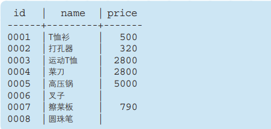
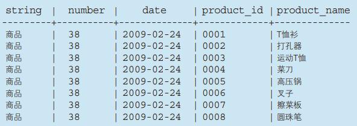
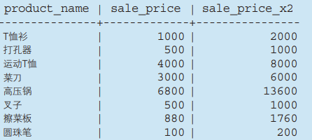
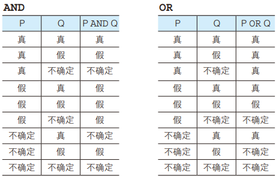

# 查询基础

## SELECT语句基础

### 列的查询

从表中选取数据时需要使用 **SELECE语句** ，也就是只从表中选出必要数据的意思。通过SELECT语句查询并选取出必要数据的过程称为**匹配查询** 或**查询**(query)。语法如下

```sql
SELECT <列名>,······ FROM <表名>;
```

该 SELECT 语句包含了 SELECT 和 FROM 两个子句(clause)。子句时SQL语句的组成要素，是以 SELECT 或者 FROM 等作为起始的短语

SELECT 子句中列举了希望从表中查询出的列的名称，而 FROM 子句则指定了选取出数据的表的名称

例如，从表 Product 中取出 product_id , product_name , purchase_price

```sql
SELECT product_id,product_name,purchase_price FROM Product
```

查询出的列的顺序可以任意指定。查询多列时，需要使用逗号进行分隔。**查询结果中列的书讯和 SELECT 子句中的顺序相同** 

### 查询表中所有的列

想要查询出全部列时，可以使用代表所有列的星号( * ),语法如下

```sql
SELECT * FROM <表名>
```

例如，输出Product表中全部的列

```sql
SELECT * FROM Product;
```

ps : 使用星号的时候，就无法设定列的显示顺序了。这时会按照 CREATE TABLE 语句的定义对列进行排序

### 为列设定别名

SQL 语句可以使用 `AS` 关键字为列设定别名。如下

```sql
SELECT  product_id   	AS id,
	product_name 	AS name,
	purchase_price AS price
	FROM Product
```

执行结果如下：



别名可以使用中文，使用中文时需要用双引号( "" )括起来,如下

```sql
SELECT  product_id   	AS "商品编号",
	product_name 	AS "商品名称",
	purchase_price AS "进货单价"
	FROM Product
```

### 常数查询

SELECT 子句中不仅可以书写列名，还可以书写常数，如下

```sql
SELECT '商品' AS string, 38 AS number, '2009-02-24' AS date,
 product_id, product_name
 FROM Product;
```

执行结果如下



### 从结果中删除重复行

想要删除重复行时，可以通过在 SELECT 子句中使用 DISTINCT 来实现

如下，使用 DISTINCT 删除 product_type 列中重复的数据

```sql
SELECT DISTINCT product_type FROM Product;
```

在使用 DISTINCT 时，NULL 也被视为一类数据。NULL 存在于多行中时，也会被合并为一条 NULL 数据

### 根据 WHERE 语句来选择记录

SELECT 语句通过 WHERE 子句来指定查询数据的条件。在 WHERE 子句中可以指定“某一列的值和这个字符串相等”或者“某一列的值大于这个数字”等条件。执行含有这些条件的 SELECT 语句，就可以查询出只符合该条件的记录了

语法如下：

```sql
SELECT <列名>,······
  FROM <表名>
 WHERE <条件表达式>;
```

例如，选取 product_type 列为“衣服”的记录的 SELECT 语句为

```sql
SELECT product_name,product_id FROM Product WHERE product_type="衣服";
```

WHERER 子句中的 `product_type="衣服"` 就是用来表示查询条件的表达式(条件表达式)。等号时比较两边的内容是否相等的符号，上述条件就是将 `product_type` 列的值和 '衣服' 进行比较，判断是否相等。Product 表的所有记录都会被进行比较。接下来会从查询出的记录中选取出 SELECT 语句指定的 product_name 列和 product_type 列

也就是**首先通过 WHERE 子句查询出符合指定条件的记录，然后再选取出 SELECT 语句指定的列**

ps：SQL中子句的书写顺序是固定的，不能随意更改。WHERE 子句必须紧跟在 FROM 子句之后，书写顺序发生的话会造成执行错误

## 算术运算符和比较运算符

### 算术运算符

SQL 语句中可以使用计算表达式，例如，把各个商品单价的 2 倍 ( sale_price的2倍 ) 以“sale_price_x2”列的形式读取出来

```sql
SELECT product_name, sale_price,
 sale_price * 2 AS "sale_price_x2"
 FROM Product;
```



sale_price_x2 列中的 sale_price * 2 就是计算销售单价的 2 倍的表达式

SQL语句中可以使用的四则运算的主要运算符

| 含义     | 运算符 |
| -------- | ------ |
| 加法运算 | +      |
| 减法运算 | -      |
| 乘法运算 | *      |
| 除法运算 | /      |

四则运算所使用的 ( +、-、*、/ ) 称为算术运算符。运算符就是使用其两边的值进行四则运算或者字符串拼接、数值大小比较等运算，并放回结果的符号。加法运算符 ( + ) 前后如果是数字或者数字类型的列名的话，就会返回加法运算后的结果。SQL中除了算术运算符之外还有其他各种各样的运算符

当然，SQL 中也可以像平常的运算表达式那样使用 ( ) 。括号中运算表达式的优先级会得到提升，优先进行计算

ps : SQL 语句中进行运算时，需要特别注意含有 NULL 的运算。**所有包含NULL的运算，结果肯定时NULL**

### 比较运算符

像符号 = 这样用来比较其两边的列或者值的符号称为比较运算符，符号 = 就是比较运算符。在 WHERE 子句中通过使用比较运算符可以组合出各种各样的条件表达式，这些比较运算符可以对字符、数字和日期等几乎所有数据类型的列和值进行比较。

比较运算符

| 运算符 | 含义      |
| ------ | --------- |
| =      | 和~相等   |
| <>     | 和~不相等 |
| >=     | 大于等于~ |
| >      | 大于~     |
| >=     | 小于等于~ |
| >      | 小于~     |

例如，选取出销售单价大于等于 1000 的记录

```sql
SELECT product_name,product_type,sale_price FROM Product WHERE sale_price>=1000
```

WHERE子句的条件表达式中也可以使用计算表达式

```sql
SELECT product_name, sale_price, purchase_price
 FROM Product
 WHERE sale_price - purchase_price >= 500;
```

在字符串中比较的时候，使用是和数字比较不同的规则。典型的规则就是按照字典顺序进行比较，也就是像姓名那样，按照条目在字典中出现的顺序来进行排序。该挥着最重要的一点就是，以相同字符开头的单词比不同字符开头的单词更相近

以书籍的章节为例

    1
   1-1
   1-2
   1-3
   2
   2-1
   2-2
   3

进行比较时，得 到的 结 果 是 '1-3' 比 '2' 小（'1-3' <
'2'），'3' 大于 '2-2'（'3' > '2'）。

#### 不能对NULL使用比较运算符

对查询条件为 NULL 的数据，SQL 提供了专门用来判断是否为 `NULL` 的 `IS NULL` 运算符，反之，希望选取不是 NULL 的数据时，需要使用 `IS NOT NULL` 运算符

如下，选取 NULL 的记录

```sql
SELECT product_name, purchase_price
 FROM Product
 WHERE purchase_price IS NULL;
```

## 逻辑运算符

通过使用逻辑运算符，可以将多个查询条件组合

### NOT 运算符

NOT 不能单独使用，必须和其他查询条件组合起来使用

例如，查询销售单价小于1000的记录也可以这样表示

```sql
SELECT product_name, product_type, sale_price
 FROM Product
 WHERE NOT sale_price >= 1000;
```

### AND 运算符和 OR 运算符

在 WHERE 子句中使用 AND 运算符或者 OR 运算符，可以对多个查询条件进行组合

AND 运算符在两侧的查询条件都成立时整个查询条件才成立，其意思相当于“并且”

例如，选取出商品种类为厨房用具 ( product_type="厨房用具" )，**并且**销售单价大于等于3000 ( sale_price >=3000 )的商品

```sql
SELECT product_name, purchase_price
 FROM Product
 WHERE product_type = '厨房用具'
 AND sale_price >= 3000;
```

OR 运算符在其两侧的查询条件有一个成立时整个查询条件都成立，其意思相当于“或者”

例如，选取出商品种类为厨房用具 ( product_type="厨房用具" )，**或者**销售单价大于等于3000 ( sale_price >=3000 )的商品

```sql
SELECT product_name, purchase_price
 FROM Product
 WHERE product_type = '厨房用具'
 OR sale_price >= 3000;
```

### 通过括号强化处理

通过使用括号让 OR 运算符先于 ADN 运算符执行

```sql
SELECT product_name, product_type, regist_date
 FROM Product
 WHERE product_type = '办公用品'
 AND ( regist_date = '2009-09-11'
 OR regist_date = '2009-09-20');
```

### 逻辑运算符和真值

以上的三个运算符 NOT、AND、OR称为逻辑运算符，真值就是值为真 ( TRUE ) 或假 ( FALSE ) 其中之一的值

在使用逻辑运算符时，如果有 NULL 参与，会出现除真假之外的第三种值——不确定 ( UNKNOWN )。与通常的逻辑运算被称为二值逻辑相对，只有SQL中逻辑运算被称为三值运算

三至逻辑中 ADN 和 OR 真值表


