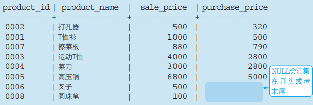

# 聚合与排序

## 对表进行聚合查询

### 聚合函数

通过SQL对数据进行某种操作或计算时需要使用**函数**。用于汇总的函数称为**聚合函数**或者**聚集函数**

SQL中常用的函数有以下2个

- COUNT : 计算表中的记录数 ( 行数 )。**`COUNT`函数的结果根据参数的不同而不同。`COUNT(*)`会得到包含 `NULL`的数据行数，而 `COUNT(<列名>)`会得到 `NULL`之外的数据行数**

  ```sql
  SELECT COUNT(*) FROM Product --获取全部数据的行数
  SELECT COUNT(purchase_price) FROM Product --获取NULL之外的数据的行数
  ```
- SUM : 计算表中数值列中数据的合计值。**聚合函数会将 `NULL`排除在外，但 `COUNT(*)`例外，并不会排除 `NULL `**

  ```sql
  SELECT SUM(sale_price) FROM Product--获取销售单价的合计值
  SELECT SUM(sale_price),SUM(purchase_price) FROM Product --计算销售单价和进货单价的合计值
  ```
- AVG : 计算表中数值列中数据的平均值。**`AVG`和 `SUM`相同，会事先删除 `NULL`在进行计算**

  ```sql
  -- 获取销售单价的平均值
  SELECT AVG(sale_price) FROM Product
  -- 计算销售单价和进货单价的平均值
  SELECT AVG(sale_price),AVG(purchase_price) FROM Product 
  ```
- MAX : 计算表中任意列中数据的最大值
- MIN : 求出表中任意列中数据的最小值

  MAX/MIN函数几乎使用与所有数据类型(只要时能够排序的数据，就肯定有最大值和最小值)的列。SUM/AVG函数只适用于数据类型的列

  ```sql
  SELECT MAX(sale_price),MIN(sale_price) FROM Product;-- 获取销售单价的最大值和最小值
  SELECT MAX(regist_date),MIN(regist_date) FROM Product-- 获取日期的最大值和最小值
  ```

### 使用聚合函数删除重复值(关键字DISTINCT)

在聚合函数的参数中使用 `DISTINCT` ，可以删除重复数据

想要计算值的种类时，可以在COUNT函数的参数中使用DISTINCT

如下，计算取出重复数据后的数据行数

```sql
SELECT COUNT(DISTINCT product_type) FROM Product
```

SUM函数

```sql
SELECT SUM(sale_price),SUM(DISTINCT sale_price) FROM Product -- DISTINCT会删除重复数据后计算
```

## 对表进行分组

使用 `GROUP BY`可以对表进行分组后汇总。语法如下

```sql
SELECT <列名1>,<列名2>,...... FROM <表名> GROUP BY <列名1>,<列名2>......
```

例如，按照商品种类统计数据数据行数

```sql
SELECT product_type,COUNT(*) FROM Product GROUP BY product_type
```

`GROUP BY`子句的书写位置也有严格要求，一定要在 `FROM`语句之后 ( 如果有 `WHERE`子句的话需要写在 `WHERE`子句之后 )

子句的书写顺序(暂定)

1.SELECT→2.FROM→3.WHERE→4.GROUP BY

在聚合键中包含NULL时，也会将NULL作为一组特定的数据

### 使用WHERE子句时GROUP BY 的执行结果

在使用GROUP BY 子句的SELECT语句中，也可以正常使用WHERE子句。语法如下

```sql
SELECT <列名1>,<列名2>,...... FROM <表名> WHERE GROUP BY <列名1>,<列名2>......
```

例如，先用WHERE子句对记录进行过滤，然后使用进货单价进行分组

```sql
SELECT purchase_price,COUNT(*) FROM Product WHERE product_type="衣服" GROUP BY purchase_price
```

### 与聚合函数和GROUP BY子句有关的常见错误

- 在 `SELECT`子句中书写了多余的列(使用 `GROUP BY`子句时，`SELECT`子句中不能出现聚合键之外的列名)

  ```sql
  -- 列名product_name并没有包含在GROUP BY子句中。因此，该列名也不能书写在SELECT子句之中
  SELECT product_name, purchase_price, COUNT(*)
   FROM Product
   GROUP BY purchase_price;
  ```
- 在 `GROUP BY`子句中写了列的别名(在 `GROUP BY`子句中不能使用 `SELECT`子句中定义的列名)
- `GROUP BY`子句的结果能排序是随机(无序)的

* 在 `WHERE`子句中使用聚合函数会发生错误（只有SELECT子句和HAVING子句以及ORDER BY 子句）中能够使用聚合函数
  ```sql
  SELECT product_type, COUNT(*)
   FROM Product
   WHERE COUNT(*) = 2
   GROUP BY product_type;
  ```

## 为聚合结果指定条件

### HAVING子句

对集合指定条件需要使用 `HAVIND`子句。`HAVING`子句必须写在 `GROUP BY`子句之后，其在DBMS内部的执行顺序也排在 `GROUP BY` 子句之后。语法如下

```sql
SELECT <列名1>,<列名2> FROM <表名> GROUP BY <列表1>,<列表2>... HAVING <分组结果对应的条件>
```

使用 `HAVING`子句时 `SELECT`语句的顺序

SELECT → FROM → WHERE → GROUP BY → HAVING

例如，针对按照商品种类进行分组后的结果，指定“包含的数据行数为2行”

```sql
SELECT product_type,COUNT(*) FROM Product GROUP BY product_type HAVING COUNT(*)=2
```

### HAVING子句的构成要素

`HAVING`子句和包含 `GROUP BY` 子句时的 `SELECT`子句一样，能够使用的要素有一定的限制，限制内容也是完全相同的

HAVING子句中能够使用的3重要素如下所示

- 常数
- 聚合函数
- GROUP BY子句中指定的列名(即聚合键)

如下就会发生错误

```sql
-- product_name列并不包含在GROUP BY子句中，因此不允许写在HAVING子句中
SELECT product_type, COUNT(*)
 FROM Product
 GROUP BY product_type
HAVING product_name = '圆珠笔';
```

ps : 聚合键所对应的条件不应该书写在HAVING子句单中，而应当书写在WHERE子句中

## 对查询结果进行排序

### ORDER BY子句

通过在SELECT语句末尾添加ORDER BY 子句来明确指定排列顺序。语法如下

```sql
SELECT <列名1>,<列名2>... FROM <表名> ORDER BY <排序基准列1>,<排序基准列2>...
```

例如，按照销售单价由低到高（升序）进行排列

```sql
SELECT product_id, product_name, sale_price, purchase_price FROM Product ORDER BY sale_price;
```

不论何种情况，`ORDER BY`子句都需要写在 `SELECT`语句的末尾。这是因为对数据行进行排序的操作必须在结果即将返回时执行。	`ORDER BY`子句中书写的列称为排序键

子句的书写顺序

1.SELECT → 2.FROM → 3.WHERE → 4.GROUP BY → 5.HAVING → 6.ORDER BY

### 指定升序或降序

想要按照由高到低，也就是降序排列时，在列名后面使用 `DESC`关键字。

使用升序进行排列时，正式的书写方式应该时使用关键字 `ASC`，但是省略该关键字时会默认使用升序进行排序

```sql
SELECT product_id, product_name, sale_price, purchase_price
 FROM Product
ORDER BY sale_price DESC;
```

### 指定多个排序键

需要对排序的数据进行更细致的排序时，需要再添加一个排序键

同时指定多个排序键，优先使用左侧的键，如果该列存在相同值的话，再接着参考右侧的键。当然，也可以同时使用3个以上的排序键。如下

```sql
SELECT product_id, product_name, sale_price, purchase_price
 FROM Product
ORDER BY sale_price, product_id;
```

### NULL的顺序

使用含有 `NULL`的列作为排序键时，`NULL`会在结果的开头或末尾汇总显示，如下

```sql
SELECT product_id, product_name, sale_price, purchase_price
 FROM Product
ORDER BY purchase_price;
```



### 在排序键中使用显示用的别名

`ORDER BY`子句中允许使用 `SELECT`子句中定义的别名别名，如下

```sql
SELECT product_id AS id, product_name, sale_price AS sp, purchase_price
 FROM Product
ORDER BY sp, id;
```

`SELECT`语句按照子句为单位的执行顺序如下

使用 `HAVING`子句时 `SELECT`语句的顺序

FROM → WHERE → GROUP BY → HAVING → SELECT → ORDER BY

### ORDER BY 子句中可以使用的列

`ORDER BY`子句中也可以使用存在于表中，但并不包含在 `SELECT`子句之中的列，如下

```sql
SELECT product_name,sale_price,purchase_price FROM Product ORDER BY product_id
```

也可以使用聚合函数

```sql
SELECT product_type, COUNT(*)
 FROM Product
 GROUP BY product_type
ORDER BY COUNT(*);
```

ps:在 `ORDER BY`子句中不要使用列编号
