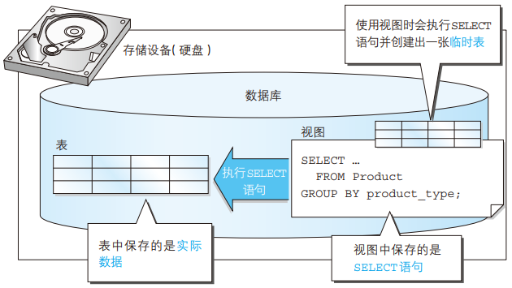
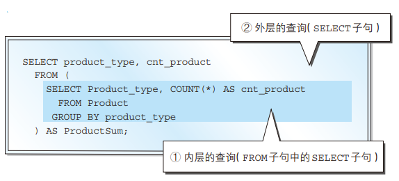

# 复杂查询

## 视图

### 视图和表

从SQL的角度来看**视图**就是一张表。在SQL语句中并不需要区分哪些是表，哪些是数据

视图和表的不同在于“是否保存了实际的数据”。

通常，在创建表时，会通过 `INSERT`语句将数据保存到数据库之中，而数据库中的数据实际上会被保存到计算机的**存储设备**(通常是硬盘)中。因此，通过 `SELECT`语句查询数据时，实际上就是匆匆存储设备（硬盘）中读取数据，进行各种计算之后，在将结果发发你会给用户这样一个过程。

但时使用视图时并不会将数据保存到存储设备中，而且也不会将数据保存到其他任何地方。实际上视图保存的时 `SELECT`语句，我们从视图从视图中读取数据时，视图会在内部执行该 `SELECT`语句并创建出一张临时表



视图的优点有两个：

- 由于视图无需保存数据，因此可以节省存储设备的容量，
- 可以将频繁使用的 `SELECT`语句保存成视图，这样就不用每次都重新书写了。创建好视图之后，只需在 `SELECT`语句中进行调用，就可以方便地得到想要的结果了

### 创建视图的方法

创建视图需要使用 `CREATE VIEW` 语句，语法如下

```sql
CREATE VIEW 视图名称(<视图列名1>,<视图列名2>...) AS <SELECT语句>
```

`SELECT`语句需要书写在 `AS`关键字之后。`SELECT`语句中列的排列顺序和视图中列的排序顺序相同。视图的列名在视图名称之后的列表中定义

例如，创建ProductSum视图

```sql
CREATE VIEW ProductSum(product_type,cnt_product) AS 
	SELECT product_type,COUNT(*) FROM Product GROUP BY product_type
```

使用视图

```sql
SELECT product_type,cnt_product FROM ProductSum
```

创建出视图之后，就可以通过非常简单的 `SELECT`语句。随时得到想要的汇总结果，并且，Product表中的数据更新之后，视图也会自动更新，飞铲灵活方便

在 `FROM`子句中使用视图的查询，通常有两个步骤

- 首先执行定义视图的 `SELECT`语句
- 根据得到的结果，再执行再FROM子句中使用视图的 `SELECT`语句。也就是说，使用视图的查询通常需要执行 2 条以上的SELECT语句

同时，还可能出现以视图为基础创建视图的**多重视图**。虽然语法上没有错误，但是我们还是应该尽量避免再视图的基础上创建视图，因为对多数DBMS来说，多重视图会降低SQL的性能

```sql
CREATE VIEW ProductSumJim (product_type, cnt_product)
AS
SELECT product_type, cnt_product
 FROM ProductSum
 WHERE product_type = '办公用品';
```

### 视图的限制

#### 定义视图时不能使用ORDER BY子句

再定义视图时可以使用任何 `SELECT`子句，但有一种情况例外，那就是不能使用 `ORDER BY`子句

因为视图和表一样，数据行都是没有顺序的。

#### 对视图进行更新

在 `SELECT`语句中视图可以和表一样使用。但是，对于INSERT、DELETE、UPDATE这类更新语句来说这其中有很严格的限制。

标准SQL中有这样的规定：如果定义视图的 `SELECT`语句能够满足某些条件，那么这个视图就可以被更新。比如：

- SELECT子句中未使用DISTINCT
- FROM子句中只有一张表
- 未使用GROUP BY子句
- 未使用HAVING子句

ps：视图和表需要同时进行更新，因此通过汇总得到的视图无法进行更新，不是通过汇总得到的视图就可以进行更新

### 删除视图

删除视图需要使用 `DROP VIEW` 语句，语法如下

```sql
DROP VIEW 视图名称(<视图列名1>,<视图列名2>,...)
```

例如

```sql
DROP VIEW ProductSum
```

## 子查询

子查询就是一次性视图(SELECT语句)。与视图不同，子查询在SELECT语句执行完毕之后就会消失

由于子查询需要命名，因此需要根据处理内容来指定恰当的名称

标量子查询就是只能返回一行一列的子查询

如下：

```sql
SELECT product_type,cnt_product FROM (SELECT product_type,COUNT(*) AS cnt_product FROM Product GROUP BY product_type) AS ProductSum
```

子查询就是将用来定义视图的 `SELECT`语句直接用于 `FROM`子句当中。虽然 `AS ProductSum`就是子查询的名称，但由于该名称时一次性的，因此不会像视图那样保存在存储介质(硬盘)中，二十在SELECT语句执行之后就消失了

实际上，该SELECT语句包含嵌套的结构，首先会执行FROM子句中的SELECT语句，然后才会执行外层的SELECT语句，如下：



由于子查询的层数原则上没有限制，因此可以像”子查询的FROM子句中还可以继续使用子查询，该子查询的FROM子句中还可以在使用子查询......“这样无线嵌套下去

### 标量子查询

标量就是单一的意思，在数据库之外的领域也经常使用

子查询基本上都会返回多行结果（虽然偶尔也会值返回 1 行数据）。由于结构和表相同，因此也会有查询不到结果的情况

而标量子查询则有一个特殊的限制，那就是**必须而且只能返回1行1列的结果**，也就是返回表中某一行的某一列的值，例如"10"这样的值

由于返回的时单一的值，因此标量子查询的返回值可以用在 = 或者 <> 这样需要单一值的比较运算符之中。这也正是标量子查询的优势所在

在WHERE子句中使用标量子查询，例如：计算单价高于平均单价的商品

```sql
SELECT product_id,product_name,sale_price FROM Product WHERE sale_price>(SELECT AVG(sale_price) FROM Product)
```

标量子查询的书写位置并不仅仅局限于WHERE子句中，通常任何可以使用单一值的位置都可以使用。也就是说，能够使用常数或者列名的地方，无论时SELECT子句、GROUP BY 子句、HAVING子句，还是ORDER BY子句，几乎所有的地方都可以使用，例如

```sql
SELECT product_type, AVG(sale_price)
 FROM Product
 GROUP BY product_type
HAVING AVG(sale_price) > (SELECT AVG(sale_price)
 FROM Product);
```

ps：注意，标量子查询绝对不能返回多行结果。也就是说，如果子查询返回了多行结果，那么就不再是标量子查询，而仅仅是一个普通的子查询了。

## 关联子查询

关联子查询会在细分的组内进行比较时使用

关联子查询和 `GROUP BY`子句一样，也可以对表中的数据进行切分

关联子查询的结合条件如果未出现在子查询之中就会发生错误

如下，通过关联子查询按照商品种类对平均销售单价进行比较

```sql
SELECT product_type,product_name,sale_price FROM Product AS P1 
	WHERE sale_price > (SELECT AVG(sale_price) FROM	Product AS P2 WHERE P1.product_type=P2.product_type GROUP BY product_type)									  

```

这里起到关键作用的就是**在子查询中添加的WHERE子句的条件**。该条件的意思就是，**在同一商品种类中**对各商品的销售单价和平均单价进行比较

关联子查询也是用来对集合进行切分的

ps：结合条件一定要写在子查询中，也就是说子查询内部设定的关联名称，只能在该子查询内部使用，如果将子查询中的关联条件移到了外层查询中，就会违反关联名称的作用域，会发生错误，如下

```sql
SELECT product_type, product_name, sale_price
 FROM Product AS P1
 WHERE P1.product_type = P2.product_type
 AND sale_price > (SELECT AVG(sale_price)
 FROM Product AS P2
 GROUP BY product_type);
```
