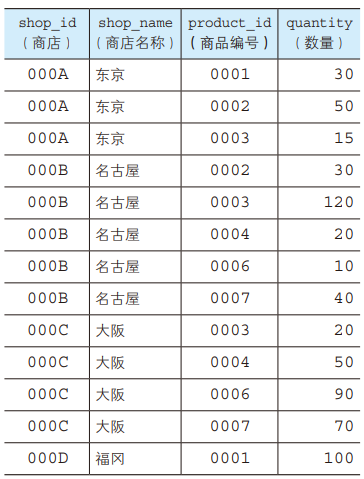

# 函数、谓词和CASE表达式

## 函数

所谓函数，就是属兔某一值得到相应输出结果的功能，输入值称为参数( parameter )，输出值称为返回值

函数大致可以分为以下几种

- 算术函数（用来进行数值计算的函数）
- 字符串函数（用来进行字符串操作的函数）
- 日期函数（用来进行日期操作的函数）
- 转换函数（用来转换数据类型和值的函数）
- 聚合函数（用来进行数据聚合的函数）

### 算术函数

- ABS是计算绝对值的函数。绝对值（absolute value）不考虑数值的符号，表示一个数到原点的距离。简单来讲，绝对值的计算方法就是：0和正数的绝对值就是其本身，负数的绝对值就是去掉符号后的结果。如下，计算数值的绝对值

  ```sql
  SELECT m,ABS(m) AS abs_col FROM SampleMath
  ```
- MOD是计算除法余数（求余）的函数，是modulo的缩写。例如， 7 / 3 的余数是 1 ，因此 `MOD( 7 , 3 )`的结果也是 1 。因为小数计算中并没有余数的概念，所以只能对整数类型的列使用MOD函数。如下，计算除法（n / p）的余数

  ```sql
  SELECT n,p,MOD(n,p) as mod_col FROM SampleMath
  ```
- ROUND 函数用来进行四舍五入操作。四舍五入在英语中称为round。如果指定四舍五入的位数为 1 ，那么就会对小数点第 2 位进行四舍五入处理。如果指定位数为 2，那么就会对第 3 位进行四舍五入处理。如下，对 m 列的数值进行 n 列位数的四舍五入处理

  ```sql
  SELECT m,n,ROUND(m,n) as round_col  FROM SampleMath
  ```

### 字符串函数

- 拼接，可以通过有两条并列的竖线变换而成的 "||" （**SQL Server使用 + ，MYSQL使用CONCAT**）函数来实现像 "abc + ab=abcab"这样将字符串进行拼接的情况，如果其中包含NULL，那么得到的结果也是NULL。如下：

  ```sql
  SELECT str1, str2,
   CONCAT(str1,str2) AS str_concat
   FROM SampleStr;
  ```
- LENGTH（字符串长度）。如下：

  ```sql
  SELECT str1,LENGTH(str1) FROM SampleStr
  ```
- LOWER（小写转换），LOWER 函数只能针对英文字母使用，它会将参数中的字符串全部转为小写。如下：

  ```sql
  SELECT str1,LOWER(str1) FROM SampleStr
  ```
- UPPER（大写转换），UPPER 函数只能针对英文字母使用，它会将参数中的字符串全部转为大写。如下：

  ```sql
  SELECT str1,UPPER(str1) FROM SampleStr
  ```
- REPLACE（字符串替换）。如下：

  ```sql
  -- str1：对象字符串
  -- str2：替换前的字符串
  -- str3：替换后的字符串
  -- req_str：返回值
  SELECT str1,str2,str3,REPLACE(str1,str2,str3) AS req_str FROM SampleStr
  ```
- SUBSTRING（字符串截取)，使用 SUBSTRING 函数可以截取出字符串中的一部分字符串。截取的起始位置从字符串最左侧开始计算。如下，截取出字符串中第 3 位和第 4 位的字符

  ```sql
  SELECT str1,SUBSTRING(str1 FROM 3 FOR 2) as sub_str FROM SampleStr
  ```

### 日期函数

- `CURRENT_DATE` 函数能噶偶返回 SQL 执行的日期，也就是该函数执行的日期，由于没有参数，因此无需使用括号。如下：

  ```sql
  SELECT CURRENT_DATE;-- 2024-01-21
  ```
- `CURRENT_TIME`能够取得 SQL 执行的时间，也就是该函数执行的时间。同样，由于没有参数，也无需使用括号

  ```sql
  SELECT CURRENT_TIME -- 17:56:10
  ```
- `CURRENT_TIMESTAMP`具有 `CURRENT_DATE`+`CURRENT_TIME`的功能，使用该函数可以同时得到当前的日期和时间，当然也可以从结果中截取日期和时间

  ```sql
  SELECT CURRENT_TIMESTAMP -- 2024-01-21 17:58:51
  ```
- `EXTRACT`可以截取日期元素，该函数的返回值并不是日期类型而是数值类型

  ```sql
  SELECT CURRENT_TIMESTAMP,
  	EXTRACT(YEAR FROM CURRENT_TIMESTAMP) AS year,
  	EXTRACT(MONTH FROM CURRENT_TIMESTAMP) AS month,
  	EXTRACT(DAY FROM CURRENT_TIMESTAMP) AS day,
  	EXTRACT(HOUR FROM CURRENT_TIMESTAMP) AS hour,
  	EXTRACT(MINUTE FROM CURRENT_TIMESTAMP) AS minute,
  	EXTRACT(SECOND FROM CURRENT_TIMESTAMP) AS second
  ```

### 转换函数

转换在SQL中主要有两层意思：

- 一是数据类型的转换，简称类型转换。进行类型转换需要使用 `CAST`函数
  ```sql
  -- SQL Server PostgreSQL
  SELECT CAST('0001' AS INTEGER) AS int_col;
  -- MySQL
  SELECT CAST('0001' AS SIGNED INTEGER) AS int_col;
  -- Oracle
  SELECT CAST('0001' AS INTEGER) AS int_col
   FROM DUAL;
  -- DB2
  SELECT CAST('0001' AS INTEGER) AS int_col
   FROM SYSIBM.SYSDUMMY1;
  ```
- 二是值的转换(COALESCE)，COALESCE 是 SQL 特有的函数。该函数会返回可变参数中左侧开始第1个不是NULL的值，参数个数是可变的，因此可以根据需要无限增加。比如，将 NULL 转换为其他值
  ```sql
  SELECT COALESCE(NULL,1) AS col_1,
  	COALESCE(NULL,'test',NULL) AS col_2,
  	COALESCE(NULL,NULL,'2020-12-12') AS col_3

  ```

## 谓词

 谓词是需要满足特定条件的函数，该条件就是返回值是真值。对通常的函数来说，返回值有可能是数字、字符串或者日期等，但是谓词的返回值全都是真值（TRUE/FALSE/UNKNOWN）

### LIKE谓词——字符串的部分一致查询

我们一般使用字符串作为查询条件的例子中使用的都是 = 。这里的 = 只有在字符串完全一致时才为真。与之相反，LIKE谓词更加模糊一些，当需要进行字符串的**部分一致查询**时需要使用该谓词。

部分一致大体可以分为前方一致、中间一致和后方一致三种类型

- 前方一致：就是选取出作为查询条件的字符串与查询对象字符串起始部分相同的记录的查询方法。比如：选取出 "**ddd**abc"

  ```sql
  SELECT * FROM SampleLike WHERE strcol LIKE "ddd%"
  ```
- 中间一致：就是选取出查询对象字符串中含有作为查询条件的字符串的户口也的查询方法。无论该字符串出现在对象字符串的最后还是中间都没有关系。比如：选取出"abc**ddd**"、"**ddd**abc"、"ab**ddd**c"

  ```sql
  SELECT * FROM SampleLike WHERE strcol LIKE "%ddd%"
  ```
- 后方一致：后方一致与前方一致相反，也就是选取出作为查询条件的字符串与查询对象字符串的末尾部分相同的记录的查询方法。比如：选取"abc**ddd**"

  ```sql
  SELECT * FROM SampleLike WHERE strcol LIKE "%ddd"
  ```

此外，我们还可以使用 _（下划线）来代替 % ，与 % 不同的时，它代表了"任意1个字符"。如下：

```sql
-- 会匹配到abcdd，而不会匹配到abcddd,因为"ddd"是 3 个字符，不满足 __ 指定的 2 个字符的条件
SELECT *
 FROM SampleLike
 WHERE strcol LIKE 'abc__';
```

### BETWEEN谓词——范围查询

使用 `BETWEEN`可以进行范围查询。该谓词与其他谓词和函数的不同之处在于它使用了 3 个函数。例如，从表prodcut中读取销售单价为 100 到 1000 的商品：

```sql
SELECT product_name,sale_price FROM Product WHERE sale_price BETWEEN 100 AND 1000 
```

BETWEEN的特点就是结果中会包含 100 和 1000 这两个临界值。如果不想让结果中包含临界值，就必须使用 `<` 和 `>` 。

### IS NULL、IS NOT NULL——判断是否为NULL

为了选取出某些值为 NULL 的列的数据，不能使用 = ，而只能使用特定的谓词 `IS NULL`

如下，选择进货单价为 NULL 的商品

```sql
SELECT product_name,purchase_price FROM Product WHERE purchase_price IS NULL
```

与此相反，想要选取 NULL 以外的数据时，需要使用 `IS NOT NULL`。如下：

```sql
SELECT product_name,purchase_price FROM Product WHERE purchase_price IS NOT NULL 
```

### IN谓词——OR的简便用法

使用 `OR`来指定多个条件查询时，随着希望选取的对象越来越多，SQL语句也会越来越长，阅读起来也会越来越困难，这时，我们可以使用 `IN`谓词来代替。如下，选取进货单价在320、500，5000的商品

```sql
SELECT product_name,purchase_price FROM Product WHERE purchase_price IN(320,500,5000)
```

反之，希望选取进货单价不在320、500，5000的商品，可以使用否定形式 `NOT IN` 来实现

```sql
SELECT product_name,purchase_price FROM Product WHERE purchase_price NOT IN(320,500,5000)
```

ps：注意，在使用 IN 和 NOT IN 时是无法选取出 NULL 数据的

### 使用子查询作为IN谓词的参数

IN 谓词（NOT IN 谓词）具有其他谓词所没有的用法，那就是可以使用子查询作为其参数

创建表 ShopProduct，数据如下



使用 IN 查询在打扮点销售的商品的销售单价

```sql
SELECT product_name,sale_price FROM Product WHERE product_id IN (SELECT product_id FROM ShopProduct WHERE shop_id='000C')
```

ps：IN 的否定形式 NOT IN 同样可以使用子查询作为参数，其语法也和 IN 完全一样

### EXIST谓词

EXIST(存在) 的谓词的主语是”记录“。EXIST 的左侧并没有任何参数。只需要在右侧书写1个参数，该参数通常都会是一个子查询

如下：选取大版店在售商品的销售单价

```sql
SELECT product_name,sale_price FROM Product AS P WHERE EXISTS (
	SELECT * FROM ShopProduct AS SP WHERE SP.shop_id='000C' AND SP.product_id=P.product_id)
```

就像 EXIST 可以用来替换 IN 一样， NOT IN 也可以用 NOT EXIST 来替换

如下，使用 NOT  EXIST 读取出东京店在售之外的商品的销售单价

```sql
SELECT product_name,sale_price FROM Product AS P WHERE NOT EXISTS (
	SELECT * FROM ShopProduct AS SP WHERE SP.shop_id='000A' AND SP.product_id=P.product_id)
```

## CASE 表达式

CASE 表达式是在区分情况时使用的，这种情况的区分在编程中通常称为（条件）分支

CASE 表达式的语法分为简单 CASE 表达式和搜索 CASE 表达式两种。但是，搜索 CASE 表达式包含了简单 CASE 表达式的全部功能。

搜索表达式的语法

```sql
CASE WHEN <求值表达式> THEN <表达式>
	WHEN <求值表达式> THEN <表达式>
	WHEN <求值表达式> THEN <表达式>
	...
END
```

WHEN 子句中的“<求值表达式>”就是类似“列 = 值”这样，返回值为真值（TRUE/FALSE/UNKNOWN）的表达式。也可以将其看作使用=、!=或者LIKE、BETWEEN等谓词编写出来的表达式

CASE 表达式会从对最初的 WHEN子句中“`<求值表达式>`”进行求值开始执行。所谓求值，就是要调查该表达式的真值是什么。如果结果为真( TRUE )，那么就反水 THEN 子句中表达式，CASE 表达式的执行到此为止。如果结果不为真，那么就跳转到下一条 WHEN 字子句的求值之中。如果直到最后的 WHEN 子句为止返回结果都不为真，那么就会返回 ELSE 中的表达式，执行终止

如下：使用CASE表达式将 A ~ C 的字符串加入到商品种类之中

```sql
SELECT product_name,
	CASE
		WHEN product_type='衣服' THEN CONCAT('A: ',product_type)
		WHEN product_type='办公用品' THEN CONCAT('B: ',product_type)
		WHEN product_type='厨房用具' THEN CONCAT('C: ',product_type)
		ELSE NULL
		END AS product_type_description
	FROM Product
```

注意: 

- ELSE 子句可以省略不写，会被默认为ELSE NULL。但为了防止有人漏读，还是要显示地写出 ELSE 子句
- CASE 表达式的 END 不能省略
- CASE 表达式的便利之处就在于它是一个表达式。也就是说，它可以书写在任意位置，也就是像“1  + 1”这样写在上面位置都可以的意思
